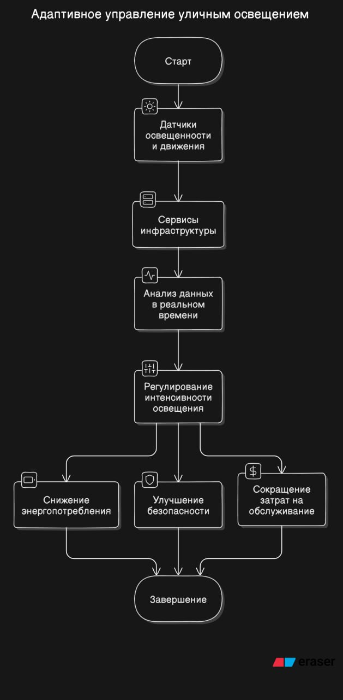
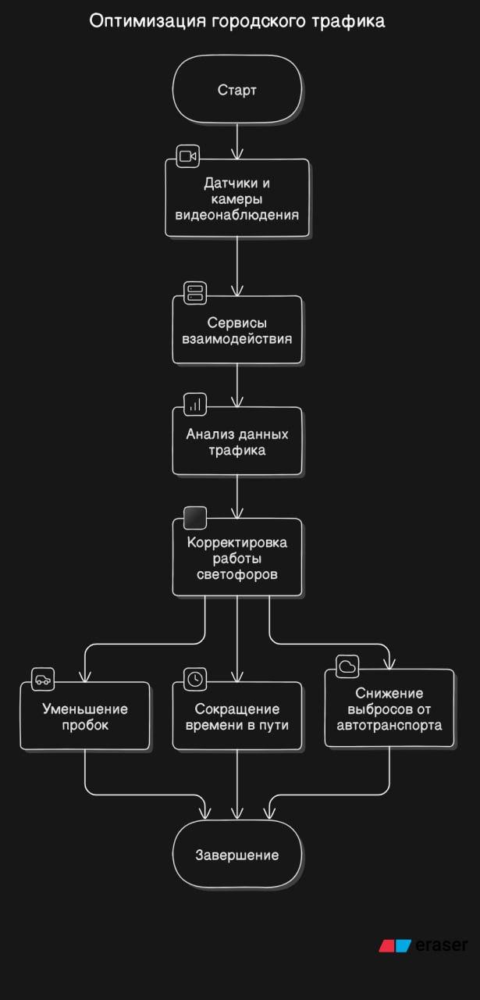
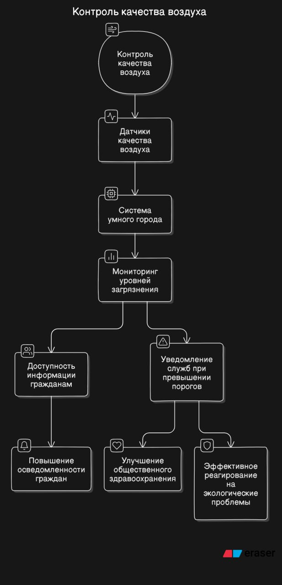
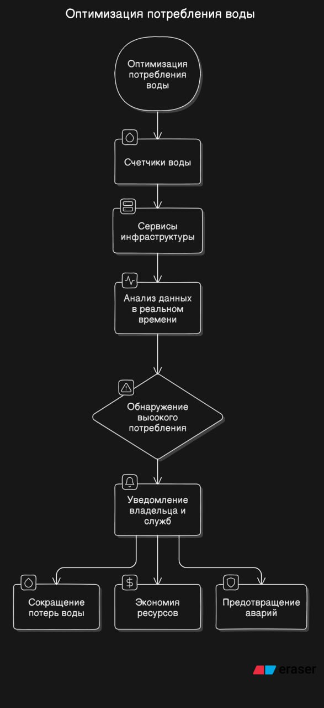
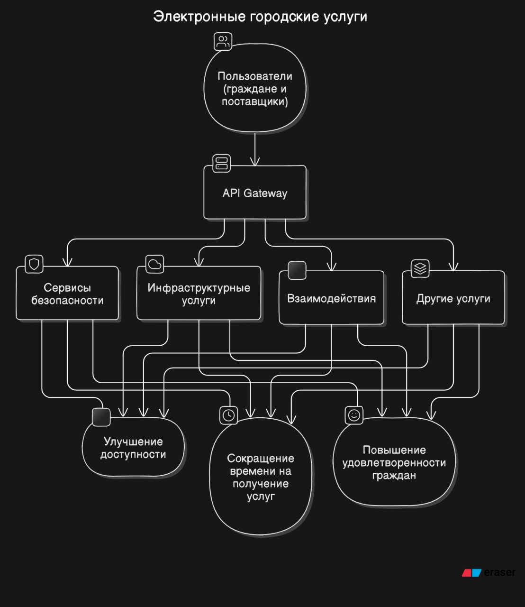

# <a name="Start"> Умный Город </a>

## Состав команды:
- Максимов Руслан - 3 курс ИВТ-22-22
- Григорьев Ярослав - 3 курс ИВТ-22-22
- Леонтьев Иван - 3 курс ИВТ-22-22
- Шеховцов Тимофей- 3 курс ИВТ-22-22

## Оглавление 
- [Умный Город](#Start)
   - [Постановка задачи](#Task)
   - [Архитектура Умного города](#Archik)
      - [Цели безопасности](#Purposes)
      - [Источники угроз безопасности информации](#Threats1)
      - [Модель нарушителя](#Intruder)
   - [Архитектура (до кибериммунизации)](#Architecture1)
      - [Негативные сценарии](#NegativeScenarios)
      - [Позитивные сценарии](#PositiveScenarios)
   - [Архитектура (после кибериммунизации)](#Architecture2)
      - [Решение](#Decision)
      - 
# <a name="Task"> Постановка задачи</a>
Необходимо изучить систему умного города, которая использует технологии для улучшения качества жизни горожан. Обеспечить безопасность данных, эффективность сервисов и улучшение инфраструктуры, предотвратить мошенничество и кибератаки, а также обеспечить надежное взаимодействие между горожанами и муниципальными службами.
 ## <a name="Task"> Определение понятия "Умный город"</a>
Согласно приказу Минстрой Росиии №866 от 25.12.2020. Умный город это - это подход к развитию города, использующего цифровые инструменты для повышения уровня жизни, качества услуг и эффективности управления при обязательном удовлетворении потребностей настоящего и будущих поколений во всех актуальных аспектах жизни. Умный город характеризуют функционирующие высокоинтеллектуальные интегрированные системы по следующим направлениям: городская среда, безопасный город, цифровое городское управление

## <a name="Archik"> Архитектура Умного города</a>
Выстраивание логичной архитектуры умного города необходимо для того, чтобы в итоге сервис, который получает житель города, эффективно работал. Архитектура умного города - это внедрение и настраивание инфраструктуры, с помощью которой он будет функционировать: базовая инфраструктура систем серверов и датчиков, алгоритмы и процессы работы, контроль работы по предоставлению услуги, наконец, внедрение удобного сервиса.

Уровень 1: Инфраструктура для функционирования умных городов (модель сервисов, возможных взаимодействий и используемых технологий между информационными системами умного города):
- концептуальная модель: представление всех информационных систем умного города;
- логическая инфраструктура: на уровне города представляет собой логику того, как связаны информационные системы между собой, на уровне отдельной системы - логика процессов внутри нее и взаимодействия со внешним миром, в том числе стандарты передачи данных и кибербезопасности;
- физическая инфраструктура: объекты для реализации определенного типа функциональности (датчики, серверы, облачные хранилища, сеть, ИКТ);
- информационная инфраструктура: массивы данных, большие данные.

Уровень 2. Обеспечение функционирования умных городов (сервисы, направленные на сопровождение деятельности и контроль сроков и качества работы по предоставлению городских услуг):
- сервисы для государства: цифровизация рутинной деятельности сотрудников для ускорения получения услуги;
- контроль исполнения услуги: обратная связь от заинтересованных сторон, а также внутренний контроль за исполнением услуги и финансами;
- экономика: сервисы контроля и планирования финансов для исполнения услуг и функционирования умных городов.

Уровень 3. Сервисы и услуги (электронные сервисы: госуслуги, электронное образование, медицина, ИТС, ЖКХ, безопасность, соцподдержка, экология) для физических и для юридических лиц:
- сервисы для получения государственных услуг: повседневные услуги, которые предоставляет государство: получение или продление водительских прав, заграничного паспорта, подача показаний счетчиков, оформление декларации, оформление квартиры, получение справок и пр.;
- сервисы для получения экстренной помощи и для жалоб: сервисы контроля жителей за состоянием общественных пространств, получения городских услуг, обращения при чрезвычайных ситуациях. Получение помощи 24/7.
- сервисы электронной демократии: опросы, голосования, инициативы.

## <a name="Threats">Модель угроз</a>
| УГРОЗЫ | ПОСЛЕДСТВИЯ|
| --- | --- |
| Кибератаки на базы данных | Похитители могут получить доступ к личным данным горожан, таким как имена, адреса, номера телефонов и паспортные данные. |
| DDoS-атаки | Злоумышленники могут пытаться перегрузить систему умного города, отправляя множество запросов, чтобы сделать её недоступной для пользователей. |
| Несанкционированный физический доступ | Мошенники могут пытаться получить физический доступ к серверам или другому оборудованию, чтобы установить вредоносное ПО или повредить систему. |
| Несанкционированный доступ | Неавторизованные пользователи могут пытаться получить доступ к системе, используя уязвимости в системе аутентификации. |
| Фальсификация данных | Злоумышленники могут пытаться ввести фальшивые данные в систему, чтобы исказать информацию о состоянии города.|

## <a name="Threats1">Источники угроз безопасности информации </a>
| Виды нарушителя | Категории нарушителя| Возможные цели реализации угроз безопасности информации|
| --- | --- | --- |
|Специальные службы иностранных государств  | Внешний | Нанесение ущерба государству в области обеспечения обороны, безопасности и правопорядка, а также в иных отдельных областях его деятельности или секторах экономики, в том числе дискредитация или дестабилизация деятельности отдельных органов государственной власти, организаций, получение конкурентных преимуществ на уровне государства, срыв заключения международных договоров, создание внутриполитического кризиса |
|Террористические, экстремистские группировки| Внешний | Совершение террористических актов, угроза жизни граждан. Нанесение ущерба отдельным сферам деятельности или секторам экономики государства. Дестабилизация общества.|
|Преступные группы (криминальные структуры)|  Внешний | Получение финансовой или иной материальной выгоды. Желание самореализации (подтверждение статуса) |
| Отдельные физические лица (хакеры)|  Внешний |  Получение финансовой или иной материальной выгоды. Любопытство или желание самореализации (подтверждение статуса)|
|Системные администраторы и администраторы безопасности|  Внутренний| Получение финансовой или иной материальной выгоды. Любопытство или желание самореализации (подтверждение статуса). Месть за ранее совершенные действия. Непреднамеренные, неосторожные или неквалифицированные действия|
| Бывшие работники (пользователи) | Внешний | Получение финансовой или иной материальной выгоды. Месть за ранее совершенные действия|
| Лица, обеспечивающие функционирование систем и сетей или обеспечивающие системы оператора (администрация, охрана, уборщики и т.д.)| Внутренний | Получение финансовой или иной материальной выгоды. Непреднамеренные, неосторожные или неквалифицированные действия|
| Поставщики вычислительных услуг, услуг связи| Внешний | Получение финансовой или иной материальной выгоды. Непреднамеренные, неосторожные или неквалифицированные действия. Получение конкурентных преимуществ|

## <a name="Purposes">Цели безопасности</a>

Цели безопасности для 1-го уровня:

1. **Обеспечение целостности и доступности данных**: обеспечение защиты данных от несанкционированного доступа, уничтожения, изменения или блокирования.
2. **Предотвращение и обнаружение киберугроз**: выявление и предотвращение киберугроз, а также обеспечение готовности к реагированию на них.
3. **Обеспечение безопасности критической инфраструктуры**: защита критической инфраструктуры, такой как системы энергоснабжения, водоснабжения и транспортной инфраструктуры.
4. **Управление рисками и уязвимостями**: выявление, оценка и управление рисками и уязвимостями, связанными с безопасностью умного города.
5. **Обеспечение безопасности граждан и гостей города**: обеспечение безопасности и комфорта граждан и гостей города, в том числе за счет использования систем видеонаблюдения и других технологий.
6. **Сохранение конфиденциальности и анонимности**: обеспечение защиты конфиденциальности и анонимности граждан и организаций при сборе, обработке и хранении данных.
7. **Обеспечение безопасности транспортной инфраструктуры**: обеспечение безопасности транспортной инфраструктуры, включая системы управления движением и логистики.
8. **Повышение готовности к ЧС и реагированию на них**: обеспечение готовности к чрезвычайным ситуациям и реагированию на них, включая использование систем оповещения и координации действий.
9. **Обеспечение безопасности систем связи**: обеспечение безопасности систем связи, включая защиту от перехвата и несанкционированного доступа.
10. **Регулярное обновление и совершенствование систем безопасности**: регулярное обновление и совершенствование систем безопасности для обеспечения защиты от новых и возникающих угроз.

Эти цели безопасности направлены на обеспечение защиты и безопасности граждан, организаций и инфраструктуры умного города от различных угроз и рисков.

## <a name="Architecture1">Архитектура (До кибериммунизации)</a>

# <a name="NegativeScenarios">Описание сценариев, при которых ЦБ нарушается</a>
## Сценарий 1: Нарушение в Транспортной Системе
Описание:
Хакеры получают доступ к Транспортной Системе через уязвимости в Умных Дорогах или Общественном Транспорте.

Последствия:
Перекрытие дорог: Хакеры могут изменить сигналы светофоров, вызвав транспортные заторы.
Отказ общественного транспорта: Введение ложных данных о маршрутах или остановках, что приведет к сбою в работе общественного транспорта.

## Сценарий 2: Нарушение в Энергетической Системе
Описание:
Атака на Умные Здания или Уличное Освещение позволяет злоумышленникам получить контроль над Энергетической Системой.

Последствия:
Отключение электроэнергии: Хакеры могут отключить электричество в ключевых районах города.
Перегрузка систем: Введение ложных данных о потреблении энергии, что может привести к перегрузке и повреждению оборудования.

## Сценарий 3: Нарушение в Системе Водоснабжения
Описание:
Злоумышленники получают доступ к Системе Водоснабжения через уязвимости в управлении данными.

Последствия:
Отключение водоснабжения: Хакеры могут отключить водоснабжение в целых районах.
Контаминация воды: Введение ложных данных о качестве воды, что может привести к ошибкам в процессах очистки и, как следствие, к загрязнению водопроводной воды.

## Сценарий 4: Нарушение в Системе Безопасности
Описание:
Атака на Видеонаблюдение или Экстренные Службы позволяет злоумышленникам получить контроль над Системой Безопасности.

Последствия:
Отключение видеонаблюдения: Хакеры могут отключить камеры, создавая слепые зоны для мониторинга.
Ложные вызовы: Введение ложных данных о чрезвычайных ситуациях, что может перегрузить экстренные службы и отвлечь их от реальных инцидентов.

## Сценарий 5: Нарушение в Экологическом Мониторинге
Описание:
Злоумышленники получают доступ к системам мониторинга Качества Воздуха или Качества Воды.

Последствия:
Ложные данные: Введение ложных данных о загрязнении, что может привести к неправильным действиям по улучшению экологии.
Игнорирование реальных проблем: Скрытие реальных данных о загрязнении, что может привести к ухудшению экологической ситуации.

## Сценарий 6: Нарушение в Управлении Отходами
Описание:
Атака на системы управления отходами позволяет злоумышленникам получить контроль над процессами сбора и утилизации отходов.

Последствия:
Сбои в сборе отходов: Хакеры могут изменить маршруты мусоровозов, что приведет к накоплению отходов.
Нарушение утилизации: Введение ложных данных о типах отходов, что может привести к неправильной утилизации и загрязнению окружающей среды.

## Сценарий 7: Нарушение в Социальных Сервисах
Описание:
Злоумышленники получают доступ к системам Здравоохранения или Образования.

Последствия:
Отказ в обслуживании: Хакеры могут заблокировать доступ к медицинским записям или образовательным ресурсам.
Кража данных: Получение доступа к персональным данным пациентов или студентов, что может привести к утечкам и злоупотреблениям.

## <a name="PositiveScenarios">Описание позитивных сценариев работы</a>

### Сценарий №1
Сценарий: "Адаптивное управление уличным освещением"

Описание: Сервисы инфраструктуры умного города анализируют данные с датчиков освещенности и движения в реальном времени. В зависимости от уровня освещенности и наличия движения на улицах система автоматически регулирует интенсивность уличного освещения, обеспечивая оптимальное использование энергоресурсов.
Положительные эффекты: Снижение энергопотребления, улучшение безопасности городских улиц в ночное время, сокращение затрат на обслуживание.

### Сценарий №2
Сценарий: "Оптимизация городского трафика"

Описание: Сервисы взаимодействия обрабатывают данные с датчиков и камер видеонаблюдения, расположенных на основных транспортных артериях, для мониторинга дорожной ситуации. На основании анализа трафика система умного города автоматически корректирует работу светофоров, чтобы минимизировать пробки и сократить время в пути.
Положительные эффекты: Уменьшение пробок, сокращение времени в пути для горожан, снижение выбросов от автотранспорта.

### Сценарий №3
Сценарий: "Контроль качества воздуха"

Описание: Система умного города использует данные с датчиков качества воздуха для мониторинга уровней загрязнения в различных районах города. Информация в реальном времени доступна гражданам через мобильные приложения и веб-сайты. При превышении пороговых значений загрязнителей система автоматически уведомляет соответствующие службы для оперативного реагирования.
Положительные эффекты: Повышение осведомленности граждан о состоянии окружающей среды, улучшение общественного здравоохранения, эффективное реагирование на экологические проблемы.

### Сценарий №4
Сценарий: "Оптимизация потребления воды"

Описание: Сервисы инфраструктуры собирают и анализируют данные от счетчиков воды в реальном времени. При обнаружении необычно высокого потребления, что может указывать на утечку, система автоматически отправляет уведомление владельцу объекта и коммунальным службам.
Положительные эффекты: Сокращение потерь воды, экономия ресурсов, предотвращение крупных коммунальных аварий.

### Сценарий №5
Сценарий: "Электронные городские услуги"

Описание: Пользователи (граждане и поставщики услуг) имеют доступ к широкому спектру городских сервисов через единый API Gateway, который обеспечивает безопасный и удобный доступ к сервисам безопасности, инфраструктурным услугам, взаимодействиям и другим. Это включает в себя всё: от оплаты коммунальных услуг до записи к врачу онлайн.
Положительные эффекты: Улучшение доступности городских услуг, сокращение времени на получение услуг, повышение удовлетворенности граждан.
Эти сценарии демонстрируют, как технологии умного города могут значительно улучшить качество жизни граждан, оптимизировать использование ресурсов и повысить эффективность управления городской инфраструктурой.

## <a name="Architecture2">Архитектура (после кибериммунизации)</a>

# <a name="Decision">Решение</a>

Для предотвращения нарушений в критически важных системах (ЦБ) в каждом из описанных сценариев, можно предпринять следующие меры:
- Актуализация и патчинг ПО: Регулярное обновление программного обеспечения для устранения известных уязвимостей.
- Многоуровневая аутентификация: Внедрение систем многофакторной аутентификации для доступа к управлению транспортной системой.
- Мониторинг трафика: Постоянный мониторинг сетевого трафика для выявления аномалий, которые могут указывать на атаку.
- Резервное копирование и восстановление:Наличие резервных систем и планов быстрого восстановления работы транспорта.

    ## Сценарий 2: Нарушение в Энергетической Системе
- Сегментация сети: Разделение энергетической сети на изолированные сегменты для минимизации риска распространения атаки.
- Физическая безопасность: Усиление физической защиты ключевых объектов энергетической инфраструктуры.
- Обучение персонала: Проведение регулярных тренингов по кибербезопасности для сотрудников.
- Регулярные аудиты: Проведение аудитов безопасности для выявления и устранения уязвимостей.

    ## Сценарий 3: Нарушение в Системе Водоснабжения
- Контроль доступа: Строгий контроль доступа к системам управления водоснабжением, использование биометрических систем.
- Шифрование данных: Шифрование данных о водоснабжении как в покое, так и в транзите.
- Реагирование на инциденты: Разработка и тестирование плана реагирования на киберинциденты.

    ## Сценарий 4: Нарушение в Системе Безопасности
- Обнаружение вторжений:Установка систем IDS/IPS для раннего обнаружения и предотвращения вторжений.
- Резервное видеонаблюдение: Наличие автономных или резервных систем видеонаблюдения, не связанных с основной сетью.
- Обучение операторов: Обучение операторов распознавать фишинг и другие методы социальной инженерии.

    ## Сценарий 5: Нарушение в Экологическом Мониторинге
- Проверка данных: Внедрение автоматических систем проверки и валидации данных на предмет аномалий.
- Резервные сенсоры: Использование независимых сенсоров для подтверждения данных от основных систем мониторинга.
- Прозрачность и отчетность: Обеспечение прозрачности в обработке данных для возможности быстрой проверки и аудита.

    ## Сценарий 6: Нарушение в Управлении Отходами
- Автоматизация и ручной контроль: Сочетание автоматизированных систем с возможностью ручного контроля для предотвращения неправильных действий.
- Обновление маршрутов: Динамическое обновление маршрутов сбора отходов через защищенные каналы связи.

    ## Сценарий 7: Нарушение в Социальных Сервисах
- Защита данных: Использование сильного шифрования для защиты персональных данных.
- Контроль и аудит доступа: Ведение логов доступа и регулярный аудит, кто и когда обращался к данным.
- Обучение пользователей:  Обучение сотрудников и пользователей систем распознавать и избегать попыток фишинга и других атак.

### Описание общих мер
Регулярное проведение аудита безопасности всей информационной системы с привлечением внешних экспертов.
Разработка и реализация политики информационной безопасности, включающей процедуры реагирования на инциденты и восстановления после атак.
Повышение осведомленности и обучение сотрудников безопасным практикам работы с информационными системами.
Реализация этих мер требует системного подхода и постоянного мониторинга информационной безопасности на всех уровнях системы умного города, а также готовности оперативно реагировать на новые угрозы и вызовы в области кибербезопасности.

### Список литературы
1. Приказ Минстроя России от 25.12.2020 N 866/пр "Об утверждении Концепции проекта цифровизации городского хозяйства "Умный город". URL: https://www.minstroyrf.gov.ru/docs/81884/
2. Приказ Минстроя России от 28.09.2023 № 696/пр «Об организации исполнения ведомственного проекта Министерства строительства и жилищно-коммунального хозяйства Российской Федерации цифровизации городского хозяйства «Умный город» и признании утратившими силу некоторых актов Министерства строительства и жилищно-коммунального хозяйства Российской Федерации». URL: https://www.minstroyrf.ru/docs/379136/
3. Приказ Минстроя России от 11 мая 2022 г. № 357/пр. Перечень базовых и дополнительных показателей цифровизации городского хозяйства - Стандарт «Умного города». URL: https://www.minstroyrf.gov.ru/docs/183409/
4. Приказ Минстроя России от 17 января 2019 г. № 18/пр «О создании рабочей группы Министерства строительства и жилищно-коммунального хозяйства Российской Федерации по запуску и реализации ведомственного проекта Цифровизации городского хозяйства «Умный город». URL: https://www.minstroyrf.gov.ru/docs/17856/
5. Приказ Минстроя России от 31 октября 2018 г. № 695/пр «Об утверждении паспорта ведомственного проекта Цифровизации городского хозяйства «Умный город». URL: https://www.minstroyrf.gov.ru/docs/17594/
6. Приказ Минстроя России от 4 февраля 2019 г. № 80/пр «Об организации исполнения ведомственного проекта Министерства строительства и жилищно-коммунального хозяйства Российской Федерации по цифровизации городского хозяйства «Умный город» и о порядке организации в Министерстве строительства и жилищно-коммунального хозяйства Российской Федерации отбора муниципальных образований в целях реализации пилотных проектов в рамках ведомственного проекта Министерства строительства и жилищно-коммунального хозяйства Российской Федерации по цифровизации городского хозяйства «Умный город». URL: https://www.minstroyrf.gov.ru/docs/17961/
