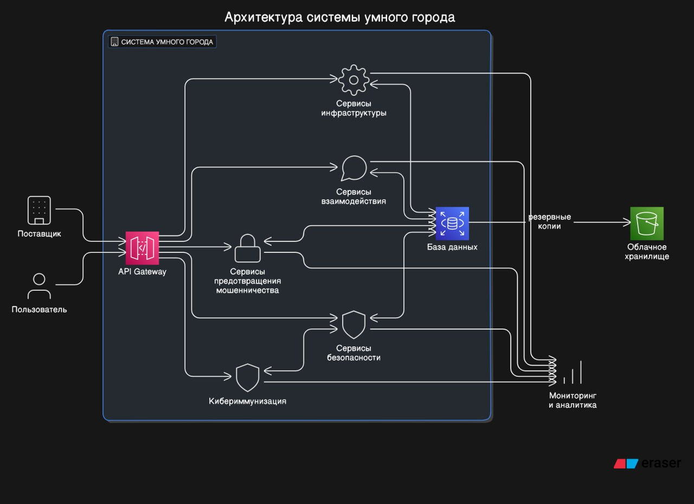

# <a name="Start"> Умный Город </a>

Состав команды:
- Максимов Руслан - 3 курс ИВТ-22-22
- Григорьев Ярослав - 3 курс ИВТ-22-22
- Леонтьев Иван - 3 курс ИВТ-22-22
- Шеховцов Тимофей- 3 курс ИВТ-22-22
##
- [Умный Город](#Start)
   - [Постановка задачи](#Task)
      - [Модель угроз](#Threats)
      - [Модель нарушителя](#Intruder)
   - [Архитектура (до кибериммунизации)](#Architecture1)
      - [Негативные сценарии](#NegativeScenarios)
      - [Позитивные сценарии](#PositiveScenarios)
   - [Архитектура (после кибериммунизации)](#Architecture2)
      - [Решение](#Decision)
##
## <a name="Task"> Постановка задачи</a>
Необходимо создать систему умного города, которая использует технологии для улучшения качества жизни горожан. Обеспечить безопасность данных, эффективность сервисов и улучшение инфраструктуры, предотвратить мошенничество и кибератаки, а также обеспечить надежное взаимодействие между горожанами и муниципальными службами.
## <a name="Threats">Модель угроз</a>
| УГРОЗЫ | ПОСЛЕДСТВИЯ|
| --- | --- |
| Кибератаки на базы данных | Похитители могут получить доступ к личным данным горожан, таким как имена, адреса, номера телефонов и паспортные данные. |
| DDoS-атаки | Злоумышленники могут пытаться перегрузить систему умного города, отправляя множество запросов, чтобы сделать её недоступной для пользователей. |
| Несанкционированный физический доступ | Мошенники могут пытаться получить физический доступ к серверам или другому оборудованию, чтобы установить вредоносное ПО или повредить систему. |
| Несанкционированный доступ | Неавторизованные пользователи могут пытаться получить доступ к системе, используя уязвимости в системе аутентификации. |
| Фальсификация данных | Злоумышленники могут пытаться ввести фальшивые данные в систему, чтобы исказать информацию о состоянии города.|
## <a name="Threats">Источники угроз безопасности информации </a>
| Виды нарушителя | Категории нарушителя| Возможные цели реализации угроз безопасности информации|
| --- | --- | --- |
|Специальные службы иностранных государств  | Внешний | Нанесение ущерба государству в области обеспечения обороны, безопасности и правопорядка, а также в иных отдельных областях его деятельности или секторах экономики, в том числе дискредитация или дестабилизация деятельности отдельных органов государственной власти, организаций, получение конкурентных преимуществ на уровне государства, срыв заключения международных договоров, создание внутриполитического кризиса |
|Террористические, экстремистские группировки| Внешний | Совершение террористических актов, угроза жизни граждан. Нанесение ущерба отдельным сферам деятельности или секторам экономики государства. Дестабилизация общества.|
|Преступные группы (криминальные структуры)|  Внешний | Получение финансовой или иной материальной выгоды. Желание самореализации (подтверждение статуса) |
| Отдельные физические лица (хакеры)|  Внешний |  Получение финансовой или иной материальной выгоды. Любопытство или желание самореализации (подтверждение статуса)|
|Системные администраторы и администраторы безопасности|  Внутренний| Получение финансовой или иной материальной выгоды. Любопытство или желание самореализации (подтверждение статуса). Месть за ранее совершенные действия. Непреднамеренные, неосторожные или неквалифицированные действия|
| Бывшие работники (пользователи) | Внешний | Получение финансовой или иной материальной выгоды. Месть за ранее совершенные действия|

## <a name="Intruder">Модель нарушителя</a>
| ТИПЫ ЗЛОУМЫШЛЕННИКОВ | ХАРАКТЕРИСТИКИ | МЕТОДЫ | МЕРЫ ЗАЩИТЫ |
| --- | --- | --- | --- | 
|Хакеры| Понимание технических аспектов| Взлом защиты с помощью хакинга| Использование надёжных паролей и двухфакторной аутентификации|
| Сотрудники| Использование статуса в корыстных умыслах | Слив информации благодаря своим должностным привилегиям| Внедрение модели Zero Trust |
| Мошенники| Использование социальной инженерии| Фишинг| Подключение почтовых фильтров |
## <a name="Purposes">Цели безопасности</a>
1. Защита конфиденциальных данных пользователей
2. Защита бизнес-процессов
3. Защита доступности данных

## <a name="Architecture1">Архитектура (До кибериммунизации)</a>

## <a name="NegativeScenarios">Описание сценариев, при которых ЦБ нарушается</a>
### Сценарий №1
Сценарий: "Компрометация API Gateway"

Описание: Злоумышленник эксплуатирует уязвимость в API Gateway, позволяющую обойти механизмы аутентификации и авторизации. Это дает возможность получить доступ к внутренним сервисам системы умного города, включая доступ к базе данных и возможность манипулировать данными сервисов безопасности, инфраструктуры, взаимодействия и предотвращения мошенничества.
Последствия: Несанкционированный доступ к чувствительным данным горожан, нарушение работы критически важных инфраструктурных и безопасностных сервисов. 

### Сценарий №2
Сценарий: "SQL-инъекция"

Описание: Злоумышленник использует уязвимости в запросах к базе данных через один из сервисов, внедряя вредоносный SQL-код. Это позволяет ему читать, модифицировать или удалять данные в базе данных, включая личные данные пользователей и критически важную информацию о работе инфраструктурных сервисов.
Последствия: Утечка или потеря данных, нарушение целостности и доступности важной информации.

### Сценарий №3
Сценарий: "DDoS-атака на API Gateway"

Описание: Злоумышленники организуют массированную DDoS-атаку на API Gateway, что приводит к перегрузке системы и отказу в обслуживании легитимных запросов от пользователей и поставщиков.
Последствия: Сервисы умного города становятся недоступными для пользователей, что нарушает работу городских сервисов и ухудшает качество жизни граждан.

### Сценарий №4
Сценарий: "Компрометация облачного хранилища"

Описание: Злоумышленники используют уязвимости в конфигурации облачного хранилища для получения доступа к резервным копиям базы данных, содержащим личные данные пользователей и служебную информацию.
Последствия: Потеря конфиденциальности важных данных, возможное их использование в мошеннических целях.

### Сценарий №5
Сценарий: "Внедрение вредоносного кода через сервисы взаимодействия"

Описание: Злоумышленник эксплуатирует уязвимость в одном из сервисов взаимодействия для внедрения вредоносного ПО, которое может перехватывать данные пользователей или осуществлять атаки на другие компоненты системы.
Последствия: Компрометация данных пользователей, нарушение работы сервисов, распространение атаки на другие системы.
Эти сценарии нарушения информационной безопасности требуют комплексного подхода к обеспечению защиты всех компонентов системы умного города, включая регулярное обновление ПО, мониторинг безопасности и обучение персонала.

## <a name="PositiveScenarios">Описание позитивных сценариев работы</a>

### Сценарий №1
Сценарий: "Адаптивное управление уличным освещением"

Описание: Сервисы инфраструктуры умного города анализируют данные с датчиков освещенности и движения в реальном времени. В зависимости от уровня освещенности и наличия движения на улицах система автоматически регулирует интенсивность уличного освещения, обеспечивая оптимальное использование энергоресурсов.
Положительные эффекты: Снижение энергопотребления, улучшение безопасности городских улиц в ночное время, сокращение затрат на обслуживание.

### Сценарий №2
Сценарий: "Оптимизация городского трафика"

Описание: Сервисы взаимодействия обрабатывают данные с датчиков и камер видеонаблюдения, расположенных на основных транспортных артериях, для мониторинга дорожной ситуации. На основании анализа трафика система умного города автоматически корректирует работу светофоров, чтобы минимизировать пробки и сократить время в пути.
Положительные эффекты: Уменьшение пробок, сокращение времени в пути для горожан, снижение выбросов от автотранспорта.

### Сценарий №3
Сценарий: "Контроль качества воздуха"

Описание: Система умного города использует данные с датчиков качества воздуха для мониторинга уровней загрязнения в различных районах города. Информация в реальном времени доступна гражданам через мобильные приложения и веб-сайты. При превышении пороговых значений загрязнителей система автоматически уведомляет соответствующие службы для оперативного реагирования.
Положительные эффекты: Повышение осведомленности граждан о состоянии окружающей среды, улучшение общественного здравоохранения, эффективное реагирование на экологические проблемы.

### Сценарий №4
Сценарий: "Оптимизация потребления воды"

Описание: Сервисы инфраструктуры собирают и анализируют данные от счетчиков воды в реальном времени. При обнаружении необычно высокого потребления, что может указывать на утечку, система автоматически отправляет уведомление владельцу объекта и коммунальным службам.
Положительные эффекты: Сокращение потерь воды, экономия ресурсов, предотвращение крупных коммунальных аварий.

### Сценарий №5
Сценарий: "Электронные городские услуги"

Описание: Пользователи (граждане и поставщики услуг) имеют доступ к широкому спектру городских сервисов через единый API Gateway, который обеспечивает безопасный и удобный доступ к сервисам безопасности, инфраструктурным услугам, взаимодействиям и другим. Это включает в себя всё: от оплаты коммунальных услуг до записи к врачу онлайн.
Положительные эффекты: Улучшение доступности городских услуг, сокращение времени на получение услуг, повышение удовлетворенности граждан.
Эти сценарии демонстрируют, как технологии умного города могут значительно улучшить качество жизни граждан, оптимизировать использование ресурсов и повысить эффективность управления городской инфраструктурой.

## <a name="Architecture2">Архитектура (после кибериммунизации)</a>

## <a name="Decision">Решение</a>

### Описание действий для предотвращения нарушения ЦБ1
Реализация строгой аутентификации и авторизации для всех запросов к API, использование механизмов OAuth, OpenID Connect или аналогичных.
Ограничение скорости запросов (rate limiting) для предотвращения атак типа DDoS.
Валидация и санитизация всех входящих данных для предотвращения атак через внедрение вредоносного кода.
Шифрование трафика между клиентами и API Gateway с использованием TLS.

### Описание действий для предотвращения нарушения ЦБ2
Использование параметризованных запросов, ORM или других мер для предотвращения SQL-инъекций.
Регулярное обновление и патчинг СУБД и управляющего программного обеспечения.
Разделение прав доступа к базе данных, минимизация числа учетных записей с высокими привилегиями.
Шифрование данных в базе данных, особенно чувствительных элементов, таких 

### Описание действий для предотвращения нарушения ЦБ3
Развертывание решений для смягчения DDoS-атак, например, специализированных сервисов защиты от DDoS.
Распределенная обработка запросов с использованием систем балансировки нагрузки.
Мониторинг трафика на предмет аномалий и автоматическое реагирование на потенциальные атаки.

### Описание действий для предотвращения нарушения ЦБ4
Шифрование данных перед их сохранением в облачном хранилище.
Управление доступом и идентификационными данными, использование политик минимальных привилегий для доступа к облачным ресурсам.
Резервное копирование и регулярное тестирование восстановления данных для обеспечения их доступности.

### Описание действий для предотвращения нарушения ЦБ5
Регулярное сканирование и обновление всех компонентов системы на предмет уязвимостей и вредоносного ПО.
Использование средств обнаружения и предотвращения вторжений (IDS/IPS) для мониторинга сетевого трафика.
Обучение персонала основам кибергигиены и методам предотвращения фишинговых атак.

### Описание общих мер
Регулярное проведение аудита безопасности всей информационной системы с привлечением внешних экспертов.
Разработка и реализация политики информационной безопасности, включающей процедуры реагирования на инциденты и восстановления после атак.
Повышение осведомленности и обучение сотрудников безопасным практикам работы с информационными системами.
Реализация этих мер требует системного подхода и постоянного мониторинга информационной безопасности на всех уровнях системы умного города, а также готовности оперативно реагировать на новые угрозы и вызовы в области кибербезопасности.

